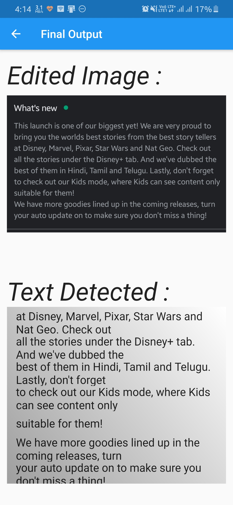

# bill_detector_team_chaos

A Bill detection application.

The app could help you extract the text from any given image which is present on your local device.

We have used Kotlin to make a basic UI for the app and have integrated it with Google Firebase ML kit for text extraction.

If you want to try the app, click on the following link ( Only available for android ) :
https://drive.google.com/file/d/13ALB67SgOurljYkqDUQ7fRrav6rmfOm6/view?usp=sharing

The Screenshot of the app

